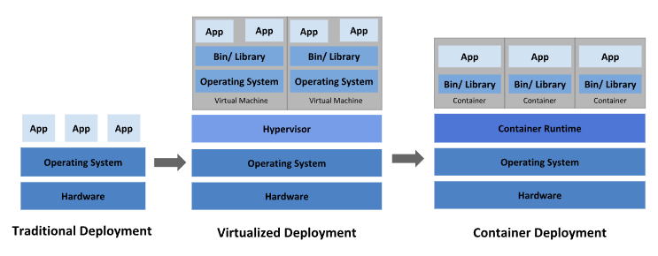

# Overview

Kubernetes is a portable, extensible, open source platform for managing containerized workloads and services, that facilitates both declarative configuration and automation. It has a large, rapidly growing ecosystem. Kubernetes services, support, and tools are widely available.

This page is an overview of Kubernetes.

The name Kubernetes originates from Greek, meaning helmsman or pilot. K8s as an abbreviation results from counting the eight letters between the "K" and the "s". Google open-sourced the Kubernetes project in 2014. Kubernetes combines [over 15 years of Google's experience](https://kubernetes.io/blog/2015/04/borg-predecessor-to-kubernetes/) running production workloads at scale with best-of-breed ideas and practices from the community.

## Why you need Kubernetes and what it can do

Containers are a good way to bundle and run your applications. In a production environment, you need to manage the containers that run the applications and ensure that there is no downtime. For example, if a container goes down, another container needs to start. Wouldn't it be easier if this behavior was handled by a system?

```
容器是运行和绑定应用程序的好方法.在产品环境,你需要管理运行应用的容器并保证它们没有停机时间.比如,一个容器停止了,另外一个容器就会启动.还有比这些更容易的吗?如果让系统来处理这些行为.
```

That's how Kubernetes comes to the rescue! Kubernetes provides you with a framework to run distributed systems resiliently. It takes care of scaling and failover for your application, provides deployment patterns, and more. For example: Kubernetes can easily manage a canary deployment for your system.

```
Kubernetes就是这样来救援的.Kubernetes为您提供了一个弹性的运行分布式应用的框架,它为您的应用程序的扩展,故障转换,发布模式等等.比如,Kubernetes可以使用Canary发布来管理你的系统.
```

Kubernetes provides you with:

- **Service discovery and load balancing** Kubernetes can expose a container using the DNS name or using their own IP address. If traffic to a container is high, Kubernetes is able to load balance and distribute the network traffic so that the deployment is stable.

  ```
  服务发现和负载均衡,Kubernetes能使用DNS Name或者它们的IP来公开容器,如果容器流量过高,Kubernetes负载均衡和分配流量,以便部署稳定.
  ```

  

- **Storage orchestration** Kubernetes allows you to automatically mount a storage system of your choice, such as local storages, public cloud providers, and more.

  ```
  存储编排,Kubernetes允许你按照自己的意愿挂载存储系统,比如local storages, public colud providers, and more.
  ```

  

- **Automated rollouts and rollbacks** You can describe the desired state for your deployed containers using Kubernetes, and it can change the actual state to the desired state at a controlled rate. For example, you can automate Kubernetes to create new containers for your deployment, remove existing containers and adopt all their resources to the new container.

  ```
  你可以使用Kubernetes描述你期望的状态在你发布的容器中,它能以可控的比率(rate)将容器的实际状态更改为你期望的状态
  ```

  

- **Automatic bin packing** You provide Kubernetes with a cluster of nodes that it can use to run containerized tasks. You tell Kubernetes how much CPU and memory (RAM) each container needs. Kubernetes can fit containers onto your nodes to make the best use of your resources.

  ```
  你提供了Kubernetes nodes集群,它可以运行容器化任务,你告诉Kubernetes每个容器需要多少CPU和RAM, Kubernetes可以将容器适合到你的节点上,以充分使用资源.
  ```

- **Self-healing** Kubernetes restarts containers that fail, replaces containers, kills containers that don't respond to your user-defined health check, and doesn't advertise them to clients until they are ready to serve.

  ```
  自我修复,Kubernetes会重启失败的容器,替换容器,会终止容器当容器无法响应用户定义的健康检查时,并且在它们未准备好服务前不会公开给客户.
  ```

- **Secret and configuration management** Kubernetes lets you store and manage sensitive information, such as passwords, OAuth tokens, and SSH keys. You can deploy and update secrets and application configuration without rebuilding your container images, and without exposing secrets in your stack configuration.

  ```
  秘密和配置管理,Kubernetes可以让你存储敏感信息,比如password,tokens and SSH keys, 你可以发布和更新这些密码和应用配置且不需要重新构建你的容器镜像, 也不会暴露秘密在你的stack配置中
  ```

- **Batch execution** In addition to services, Kubernetes can manage your batch and CI workloads, replacing containers that fail, if desired.

  ```
  批量执行, 除了服务之外, Kubernetes可以管理你的批处理和持续集成的工作负载, 并在需要时替换失败的容器
  ```

- **Horizontal scaling** Scale your application up and down with a simple command, with a UI, or automatically based on CPU usage.

  ```
  水平伸缩,可以使用简单的命令,UI或者基于CPU使用率来自动扩展或缩减你的应用程序
  ```

- **IPv4/IPv6 dual-stack** Allocation of IPv4 and IPv6 addresses to Pods and Services

  ```
  分配给pod或者service, Ipv4/Ipv6
  ```

- **Designed for extensibility** Add features to your Kubernetes cluster without changing upstream source code

  ```
  可扩展性设计 ,无需修改上流源代码给你的Kubernetes集群增加功能
  ```

## What Kubernetes is not

Kubernetes is not a traditional, all-inclusive PaaS (Platform as a Service) system. Since Kubernetes operates at the container level rather than at the hardware level, it provides some generally applicable features common to PaaS offerings, such as deployment, scaling, load balancing, and lets users integrate their logging, monitoring, and alerting solutions. However, Kubernetes is not monolithic, and these default solutions are optional and pluggable. Kubernetes provides the building blocks for building developer platforms, but preserves user choice and flexibility where it is important.

```
Kubernetes不是一个传统的,包罗所有的PaaS的系统.由于Kubernetes是在容器级别而不是硬件级别,它提供了一些PaaS的常用功能,比如发布,弹性伸缩,负载均衡,并且让用户集成他们的日志,监控,和告警的解决方案.然而,Kubernetes并非单体式架构, 这些默认解决方案是可选和可插拨的.Kubernetes提供了构建开发者平台的构建基石,但在重要的地方保留了用户的选择和灵活性.
```

  Kubernetes:

  - Does not limit the types of applications supported. Kubernetes aims to support an extremely diverse variety of workloads, including stateless, stateful, and data-processing workloads. If an application can run in a container, it should run great on Kubernetes.

    ```
    不能限制支持的应用程序类型,Kubernetes支持极其多样的工作负载, 包括有状态,无状态和数据处理工作负载,如果一个应用能在容器中运行,那么它就能在Kubernetes中运行得很好.
    ```

  - Does not deploy source code and does not build your application. Continuous Integration, Delivery, and Deployment (CI/CD) workflows are determined by organization cultures and preferences as well as technical requirements.

  - ```
    不发布代码也不构建应用程序, 持续集成,交付,CICD工作流等取决组织的文化,偏好和技术要求
    ```

  - Does not provide application-level services, such as middleware (for example, message buses), data-processing frameworks (for example, Spark), databases (for example, MySQL), caches, nor cluster storage systems (for example, Ceph) as built-in services. Such components can run on Kubernetes, and/or can be accessed by applications running on Kubernetes through portable mechanisms, such as the [Open Service Broker](https://openservicebrokerapi.org/).

    ```
    不提供应用程序层面的服务作为内置服务,比如中间件(消息总线),数据处理框架(spark),数据库(mysql),缓存或者集群存储系统(Ceph),这些组件能在Kubernetes运行, 并且/或者由Kubernetes运行的可移植机制来访问,比如 Open Service Broker
    ```

  - Does not dictate logging, monitoring, or alerting solutions. It provides some integrations as proof of concept, and mechanisms to collect and export metrics.

    ```
    不指定日志,监控和告警解决方案, 它提供了一些集成作为概念验证,以及收集和导出机制
    ```

  - Does not provide nor mandate a configuration language/system (for example, Jsonnet). It provides a declarative API that may be targeted by arbitrary forms of declarative specifications.

    ```
    不提供也不强制要求配置语言/系统(Jsonnet),它提供了一个声明式的api,可以通过任意形式来指定规范
    ```

  - Does not provide nor adopt any comprehensive machine configuration, maintenance, management, or self-healing systems.

    ```
    不提供也不采用任何全面的机器配置,维护,管理 和自我修复系统.
    ```

  - Additionally, Kubernetes is not a mere orchestration system. In fact, it eliminates the need for orchestration. The technical definition of orchestration is execution of a defined workflow: first do A, then B, then C. In contrast, Kubernetes comprises a set of independent, composable control processes that continuously drive the current state towards the provided desired state. It shouldn't matter how you get from A to C. Centralized control is also not required. This results in a system that is easier to use and more powerful, robust, resilient, and extensible.

    ```
    此外, Kubernetes不仅仅是一个编排系统,事实上, 它消除了编排.预定的工作流执行指定了编排的技术定义,什么时候做A,什么时候做B,做C等.相比之下,Kubernetes包含一套独立的,可组合的流程持续推动当前状态往期望状态发展.如何从A到C并不重要, 中央控制也不是需要的, 这使得系统更加易手,更强大,更稳定,更有弹性也更有可扩展性.
    ```

## Historical context for Kubernetes

Let's take a look at why Kubernetes is so useful by going back in time.




**Traditional deployment era:**

Early on, organizations ran applications on physical servers. There was no way to define resource boundaries for applications in a physical server, and this caused resource allocation issues. For example, if multiple applications run on a physical server, there can be instances where one application would take up most of the resources, and as a result, the other applications would underperform. A solution for this would be to run each application on a different physical server. But this did not scale as resources were underutilized, and it was expensive for organizations to maintain many physical servers.

```
传统发布时代, 在早期, 组织在物理服务器上运行程序,这没办法为物理服务器上的应用定义绑定资源,导致了资源分配的问题.比如, 假如有多个应用在物理服务器上运行,在某些情况下,如果其中一个应用占用了大量的资源,结果就是其他应用程序就会表现不佳, 一个解决方案就是将不同的应用运行在不同的物理服务器上.但是这样并不能扩展,因为资源将不会充分被利用, 这对于组织来管理如此多的物理服务器来说是很昂贵的.
```

**Virtualized deployment era:**

As a solution, virtualization was introduced. It allows you to run multiple Virtual Machines (VMs) on a single physical server's CPU. Virtualization allows applications to be isolated between VMs and provides a level of security as the information of one application cannot be freely accessed by another application.

Virtualization allows better utilization of resources in a physical server and allows better scalability because an application can be added or updated easily, reduces hardware costs, and much more. With virtualization you can present a set of physical resources as a cluster of disposable virtual machines.

Each VM is a full machine running all the components, including its own operating system, on top of the virtualized hardware.

```
作为一个解决方案,引入虚拟化. 它允许你在单独物理机上的CPU运行多个VMs, 虚拟化允许应用程序在虚拟机之间隔离,并提供一定程度的安全性,因为一个应用程序的信息不能被另外一个应用程序访问.
虚拟化允许物理机有更好的资源利用率和更好的弹性伸缩,因为应用程序更加轻松的增加或者更新, 减少硬件的费用等等. 通过虚拟化,您能将一组物理资源呈现为一次性虚拟机集群.
```

**Container deployment era:**

Containers are similar to VMs, but they have relaxed isolation properties to share the Operating System (OS) among the applications. Therefore, containers are considered lightweight. Similar to a VM, a container has its own filesystem, share of CPU, memory, process space, and more. As they are decoupled from the underlying infrastructure, they are portable across clouds and OS distributions.

Containers have become popular because they provide extra benefits, such as:

- Agile application creation and deployment: increased ease and efficiency of container image creation compared to VM image use.
- Continuous development, integration, and deployment: provides for reliable and frequent container image build and deployment with quick and efficient rollbacks (due to image immutability).
- Dev and Ops separation of concerns: create application container images at build/release time rather than deployment time, thereby decoupling applications from infrastructure.
- Observability: not only surfaces OS-level information and metrics, but also application health and other signals.
- Environmental consistency across development, testing, and production: runs the same on a laptop as it does in the cloud.
- Cloud and OS distribution portability: runs on Ubuntu, RHEL, CoreOS, on-premises, on major public clouds, and anywhere else.
- Application-centric management: raises the level of abstraction from running an OS on virtual hardware to running an application on an OS using logical resources.
- Loosely coupled, distributed, elastic, liberated micro-services: applications are broken into smaller, independent pieces and can be deployed and managed dynamically – not a monolithic stack running on one big single-purpose machine.
- Resource isolation: predictable application performance.
- Resource utilization: high efficiency and density