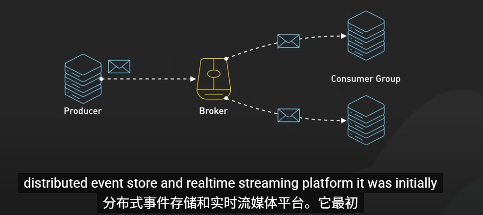
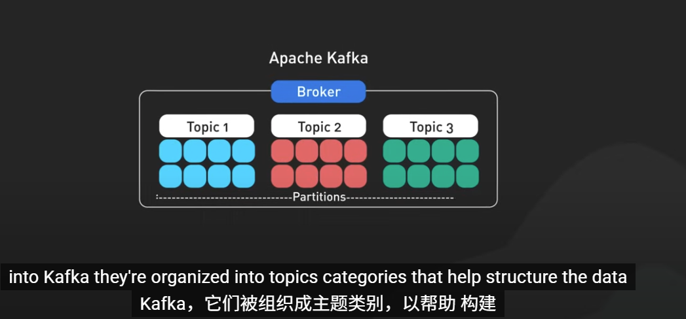
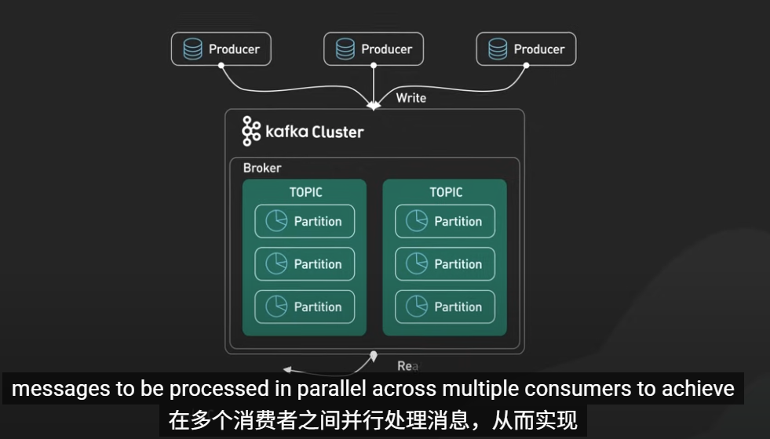
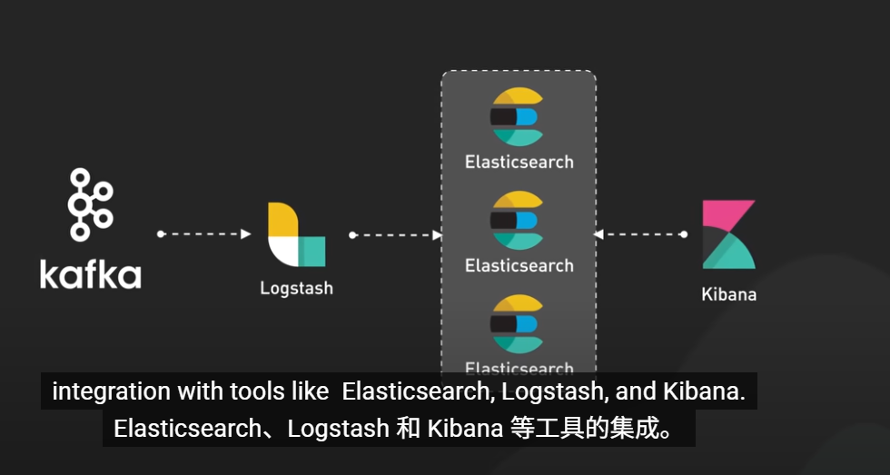

# Introduction

This is a Kafka introduction.

# Apache Kafka Fundamentals You Should Know

[url]: https://www.youtube.com/watch?v=-RDyEFvnTXI

## what is kafka

其本质是生产者产生数据,发送给CFA,再由消费者来消费数据

## what is message

消息是 Kafka 的核心。Kafka 处理的每一条数据都是一条消息

## 使用主题和分区来组织这些消息

分区并行处理消息从而实现高吞吐量

## 为什么这么多公司选择kafka

因为kafka擅长同时处理多个生产者还不会降低性能,先来谈谈它如此强大的原因 Cafe 擅长处理多个生产者同时发送数据而不会降低性能,允许不同的消费者组独立读取同一主题，从而有效地处理多个消费者。kafka跟踪已使用消费者偏移量消费的消息，kafka 本身内部存储，这确保了消费者在发生故障时可以从中断的地方恢复处理。最重要的是，Kafka 提供了这种spased 保留策略，允许我们根据时间或大小限制存储消息，即使它们已被消费，我们也不会丢失任何东西，除非我们决定是时候清除它了。最后capus 可扩展性意味着我们可以从小处着手，并随着需求的扩大而发展。现在让我们看看产品生产者，创建并向 Kafka 发送消息的应用程序生产者将消息批量处理以减少网络流量。如果没有密钥，他们使用分区器来确定消息应该发送到哪个分区。如果存在密钥，则将消息随机分布在各个分区中。具有相同密钥的消息将发送到同一分区，以便更好地进行分发。在接收端，我们有消费者和消费者组。一个组中的消费者共同负责并行处理来自不同请求的消息。在任何给定时间，每个请求都只分配给组内的一个消费者。如果一个消费者发生故障，另一个消费者会自动接管其工作负载，以确保不间断处理。组中的消费者通过cfa 的组协调员的协调来划分分区。当消费者加入或离开组时，Capa 会触发重新平衡以在剩余的消费者之间重新分配分区。kafka集群本身由多个Broker 组成。这些服务器存储和管理我们的数据，以确保数据安全。每个分区都使用领导跟随模型在多个 Broker 之间复制。如果一个 Broker 发生故障，另一个 Broker 会介入成为新的 Leader，而不会丢失任何数据。在早期版本中，Capco依靠 Zookeeper 来管理 Broker 元数据和 Leader 选举。然而，较新的版本正在过渡到构建共识机制,通过消除Zookeeper 作为外部依赖来简化操作，同时提高可扩展性。最后，让我们快速了解一下 kafka在现实世界中表现出色，它被广泛用于从数千台服务器聚合日志，通常用于从各种来源进行实时事件流式传输以捕获变更数据，它使数据库在系统之间保持同步，并且对于系统监控非常有价值，通过收集金融、医疗保健、零售和物联网等行业的仪表板和警报指标.

# kafka五大经典用例

## 案例一 日志分析

今天的日志分析不仅仅是 处理日志。 它是关于实时集中和分析来自 复杂分布式系统的日志.Kafka 在这方面表现出色，因为它可以 同时从多个来源提取日志。想想微服务、云平台和各种应用程序。 它可以处理这种 高容量，同时保持低延迟。现代日志分析的强大之处在于 Kafka 与Elasticsearch、Logstash 和 Kibana 等工具的集成。这被称为 ELK 堆栈。Logstash 从 Kafka 中提取日志。它处理它们并将它们发送到 Elasticsearch。然后，Kibana 让工程师实时可视化 和分析这些日志。

## 案例二实时 机器学习管道

现代机器学习系统需要 快速、连续地处理大量数据。  Kafka 的流处理 功能使其非常适合此用途。Kafka 充当 ML 管道的中枢神经系统 。 它从各种来源获取数据。这可能是用户交互、物联网设备或金融交易。 这些数据 通过 Kafka 实时流向 ML 模型。例如，在欺诈检测系统中， Kafka 将交易数据传输到模型。这些模型可以立即标记可疑活动 。 在预测性维护中，它可能会将机器的传感器数据汇集 到预测故障的模型中。Kafka's integration with stream processing.Kafka 与Apache Flink 或 Spark Streaming 等流处理框架的集成是关键。这些工具可以从 Kafka 读取数据，运行 复杂的计算或 ML 推理，并将结果写回 Kafka——所有这些都是实时的。还值得一提的是 Kafka Streams。 这 是 Kafka 的原生流处理库。 它允许我们直接在 Kafka 上构建可扩展、容错的流 处理应用程序。

## 第三个用例是实时 系统监控和警报

虽然日志分析有助于调查过去的事件，但这种用例是不同的。 它是关于即时、 主动的系统健康跟踪和警报。Kafka 是 整个基础设施指标和事件的中心枢纽。它从各种来源获取数据 ——应用程序性能指标、服务器健康统计数据、网络 流量数据等等。其与众不同之处在于 这些指标的实时处理。 当数据流经 Kafka 时，流处理应用程序会不断 对其进行分析。 它们可以计算聚合、检测异常或触发 警报——所有这些都是实时的。Kafka 的发布-订阅模型在这里大放异彩。 多个专门的消费者可以处理相同的指标流而 不会互相干扰。个人可能会更新仪表板， 另一个人可能会管理警报，而第三个人可能会为机器 学习模型提供预测性维护。此外，Kafka 的持久性 模型允许“时间旅行”调试。 我们可以重放指标流 来了解导致事件发生的系统状态。 此功能 可以加快根本原因分析。

## 第四个用例是变更数据捕获

CDC 是一种用于跟踪 和捕获源数据库中的变化的方法。 它允许将这些更改 实时复制到其他系统。在这种架构中，Kafka 充当从源数据库 到各种下游系统的流式传输更改的中心枢纽。该过程从 源数据库开始。 这些是发生数据变化的主要数据库。

这些数据库生成一个事务日志，按发生的顺序 记录所有数据修改，例如插入、更新和删除 。 交易日志输入到 Kafka。Kafka 将这些变化事件存储在主题中。这允许多个消费者 独立地读取它们。 这就是 Kafka 作为可扩展、 持久的消息代理的强大功能发挥作用的地方。为了在 Kafka 和其他系统之间移动数据 ，我们使用 Kafka Connect。该框架允许我们 构建和运行各种连接器。例如，我们可能有 一个 ElasticSearch 连接器将数据流式传输到 Elasticsearch 以 实现强大的搜索功能，而 DB 连接器可能会将数据复制到 其他数据库以进行备份或扩展。

## 第五个用例是系统迁移

